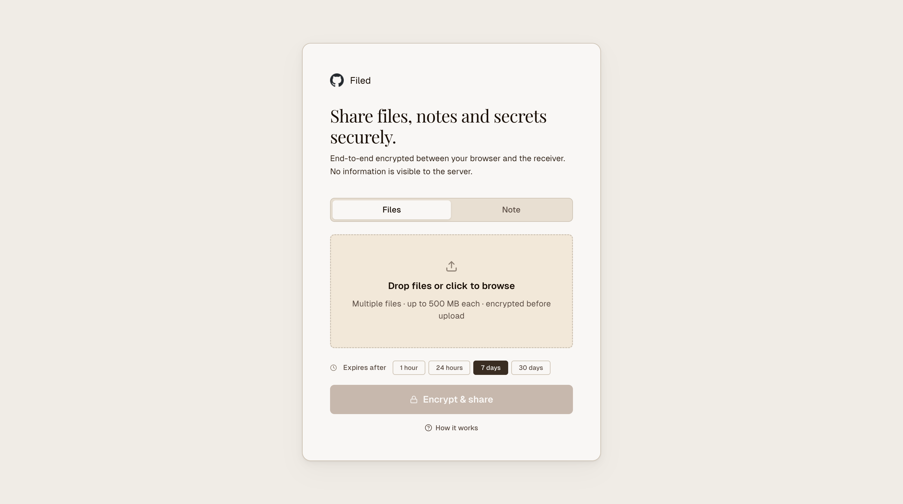
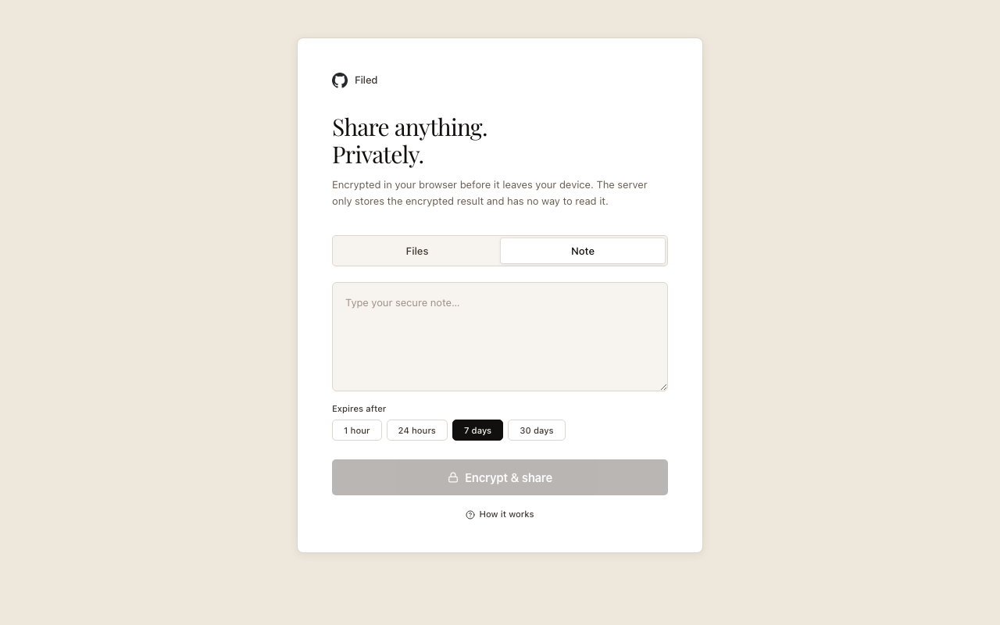
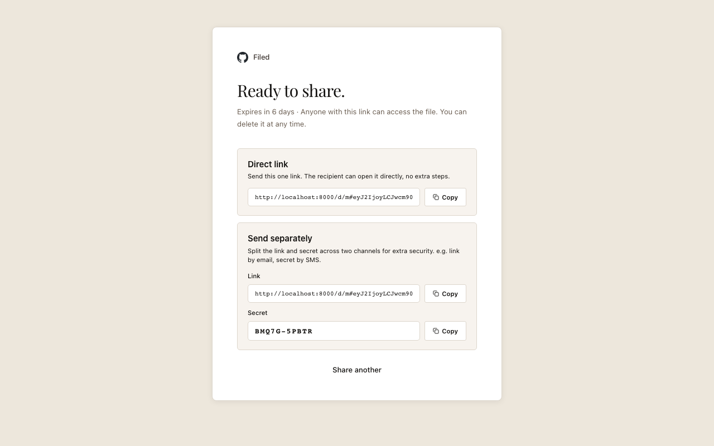
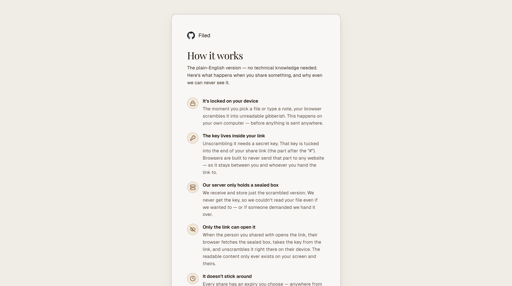
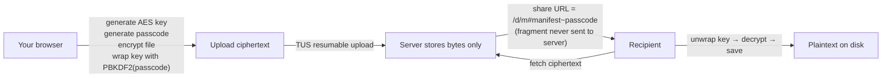

<p align="center">
  <strong>SafeShare</strong>
</p>

<p align="center">
  Self hosted end to end encrypted file, secrets and note sharing.<br>
  No database, single binary, extremely easy to run.
</p>

<p align="center">
  <a href="https://github.com/a7ul/safeshare/actions/workflows/ci.yml"></a>
  <a href="LICENSE"></a>
</p>

<p align="center">
  <a href="#running-locally">Quick Start</a> ·
  <a href="#configuration">Configuration</a> ·
  <a href="#how-it-works">How It Works</a> ·
  <a href="#deployment-recipes">Deploy</a> ·
  <a href="#security">Security</a>
</p>

---

## Try it locally

**macOS & Linux, one command:**

```bash
curl -fsSL https://raw.githubusercontent.com/a7ul/safeshare/main/run.sh | sh
```

That script detects your platform, downloads the right pre-built binary from the latest release, and starts the server. When it's running you'll see:

```
SafeShare → http://localhost:8000
```

Open that link and start sharing. No Deno, no Node, no Docker required.

<details>
<summary>What the script does</summary>

```sh
#!/usr/bin/env sh
set -e
OS=$(uname -s)
ARCH=$(uname -m)
case "${OS}-${ARCH}" in
  Darwin-arm64)  BIN=safeshare-macos-arm64 ;;
  Darwin-x86_64) BIN=safeshare-macos-x64   ;;
  Linux-x86_64)  BIN=safeshare-linux-x64   ;;
  Linux-aarch64) BIN=safeshare-linux-arm64  ;;
  *) echo "Unsupported platform: ${OS}-${ARCH}"; exit 1 ;;
esac
BASE=https://github.com/a7ul/safeshare/releases/latest/download
curl -fsSL "${BASE}/${BIN}" -o safeshare
chmod +x safeshare
echo "SafeShare → http://localhost:8000"
./safeshare
```

</details>

---

## Screenshots

<p align="center">
  
  
</p>
<p align="center">
  
  
</p>

---

## How it works



Files are encrypted in your browser using **AES-256-GCM** before upload. The file key is wrapped with **AES-KW** using a **PBKDF2**-derived key from a random passcode. The server stores only opaque bytes. It cannot decrypt anything even with full disk access.

The decryption key and passcode live exclusively in the **URL fragment**, which browsers never transmit in HTTP requests.

## Quick Start

```bash
git clone git@github.com:a7ul/safeshare.git
cd safeshare

# Build the React frontend
deno task build-frontend

# Start the server
deno task start
```

Open http://localhost:8000.

**With branding:**

```bash
LOGO_URL="https://example.com/logo.png" \
TITLE="Acme Corp" \
STORAGE_DIR=/var/lib/safeshare \
deno task start
```

**Single binary:**

```bash
deno task build-frontend
deno task compile
./safeshare
```

**Docker:**

```bash
docker run -p 8000:8000 -v /data/safeshare:/data \
  -e STORAGE_DIR=/data \
  -e TITLE="Acme Corp" \
  ghcr.io/a7ul/safeshare:latest
```

## Features

| | |
|---|---|
| AES-256-GCM browser encryption | Server never sees plaintext |
| PBKDF2 + AES-KW key wrapping | Server can't decrypt even with the stored bytes |
| TUS resumable uploads | Up to 500 MB per file, survives network drops |
| Multi-file bundles | One link for multiple files |
| Secure notes | Text encrypted before leaving the browser |
| Per-share expiry | 1 hour · 24 hours · 7 days · 30 days |
| Two share modes | Single unified link, or link + passcode separately |
| Configurable branding | Logo and company name via env vars |
| Same-origin logo proxy | No mixed-content warnings |
| Single binary | No database, cache, or queue |
| E2E tested | 19 Playwright tests |
| MIT licensed | |

## Configuration

| Variable | Default | Description |
|---|---|---|
| `PORT` | `8000` | HTTP port |
| `STORAGE_DIR` | `/tmp/e2eshare` | Where encrypted uploads are stored |
| `LINK_TTL_DAYS` | `30` | Maximum share link lifetime in days (server-enforced cap) |
| `LOGO_URL` | _(blank)_ | Company logo URL, proxied through `/api/logo` same-origin |
| `TITLE` | _(blank)_ | Company name shown next to the logo |

## Running locally

### Prerequisites

- [Deno](https://deno.land) 2.x
- Node.js 20+ and npm (frontend build only)

### Development (hot reload)

```bash
# Terminal 1: Deno backend with file watching
deno task dev

# Terminal 2: Vite frontend dev server with HMR at :5173
cd frontend && npm run dev
```

### E2E tests

```bash
deno task start &
cd frontend && npm run test:e2e
```

### Compile to a single binary

```bash
deno task build-frontend
deno task compile
./safeshare
```

Cross-compile targets: `x86_64-unknown-linux-gnu` · `aarch64-unknown-linux-gnu` · `x86_64-pc-windows-msvc` · `x86_64-apple-darwin` · `aarch64-apple-darwin`

## Releases

Pre-built binaries for all platforms are attached to each [GitHub release](https://github.com/a7ul/safeshare/releases).

```bash
# Linux x64
curl -L https://github.com/a7ul/safeshare/releases/latest/download/safeshare-linux-x64 \
  -o safeshare && chmod +x safeshare && STORAGE_DIR=/var/lib/safeshare ./safeshare

# macOS Apple Silicon
curl -L https://github.com/a7ul/safeshare/releases/latest/download/safeshare-macos-arm64 \
  -o safeshare && chmod +x safeshare && STORAGE_DIR=/var/lib/safeshare ./safeshare
```

Docker images are published to `ghcr.io/a7ul/safeshare` on every push to `main` and on every release tag.

## Deployment recipes

| Platform | Guide |
|---|---|
| Docker | [deploy/docker/README.md](deploy/docker/README.md) |
| Docker Compose | [deploy/docker-compose/README.md](deploy/docker-compose/README.md) |
| Kubernetes (Ingress + HTTPRoute) | [deploy/k8s/README.md](deploy/k8s/README.md) |
| Deno Deploy | [deploy/deno-deploy/README.md](deploy/deno-deploy/README.md) |
| Vercel | [deploy/vercel/README.md](deploy/vercel/README.md) |

**Kubernetes + GCS lifecycle (auto-cleanup):**

```bash
gcloud storage buckets create gs://my-safeshare --location=US
echo '{"lifecycle":{"rule":[{"action":{"type":"Delete"},"condition":{"age":7}}]}}' > lc.json
gcloud storage buckets update gs://my-safeshare --lifecycle-file=lc.json
```

Mount the bucket via the Cloud Storage FUSE CSI driver. Objects are auto-deleted after `LINK_TTL_DAYS` days with no cron job needed. See [deploy/k8s/README.md](deploy/k8s/README.md).

## Cutting a release

```bash
# 1. Bump version in deno.json
# 2. Commit and push
git add deno.json && git commit -m "chore: bump version to X.Y.Z" && git push

# 3. Tag: triggers the release workflow (binaries + Docker image)
git tag vX.Y.Z && git push origin vX.Y.Z
```

## Security

- **The server never sees plaintext.** All crypto runs in the browser via the Web Crypto API. The server has zero crypto code.
- **Two layers of protection.** AES-256-GCM file encryption + PBKDF2/AES-KW key wrapping means the server cannot decrypt stored blobs even with full disk access.
- **URL fragment privacy.** The passcode and manifest travel in the `#` fragment, which browsers strip before sending HTTP requests and CDNs do not log. They are visible in browser history. Use "share separately" to send link and passcode via different channels for maximum privacy.
- **Server-enforced expiry.** The server returns HTTP 410 for expired links regardless of the client manifest.
- **No authentication.** Anyone with the link (and passcode) can decrypt. Add ingress-level rate limiting for public deployments.

## Project structure

```
safeshare/
  main.ts                      Deno/Hono server: API, logo proxy, static serving
  src/
    tus.ts                     TUS handler (reads expiry from Upload-Metadata)
    storage.ts                 Blob storage (STORAGE_DIR, server-side TTL cap)
  frontend/
    src/
      pages/
        UploadPage.tsx
        DownloadPage.tsx
        HowItWorksPage.tsx
      components/
        SecureUploader.tsx      Upload UI with expiry picker and always-passcode flow
        BrandRow.tsx            Logo + company name with onError fallback
      lib/
        crypto.ts               AES-256-GCM · PBKDF2 · AES-KW · passcode gen (browser only)
        manifest.ts             Multi-file manifest v2 encode/decode
        uploader.ts             TUS client (sends expiry via Upload-Metadata header)
        expiry.ts               Expiry formatting
      hooks/
        useConfig.ts            /api/config (logo + title)
    e2e/
      secureshare.spec.ts       19 Playwright E2E tests
  deploy/
    docker/                     Dockerfile + instructions
    docker-compose/             docker-compose.yml
    k8s/                        Namespace · PVC · ConfigMap · Deployment · Service
                                Ingress (nginx) · HTTPRoute (Gateway API)
    deno-deploy/                Notes (needs storage adapter for serverless)
    vercel/                     Notes (frontend-only deploy recommended)
  .github/
    workflows/
      ci.yml                    Build + E2E on every push/PR; Docker push on main merge
      release.yml               Cross-platform binaries + GitHub release on v* tag
      automerge.yml             Auto-merge Dependabot patch/minor PRs
    dependabot.yml              Weekly npm + Actions updates
```

## License

MIT, see [LICENSE](LICENSE).
